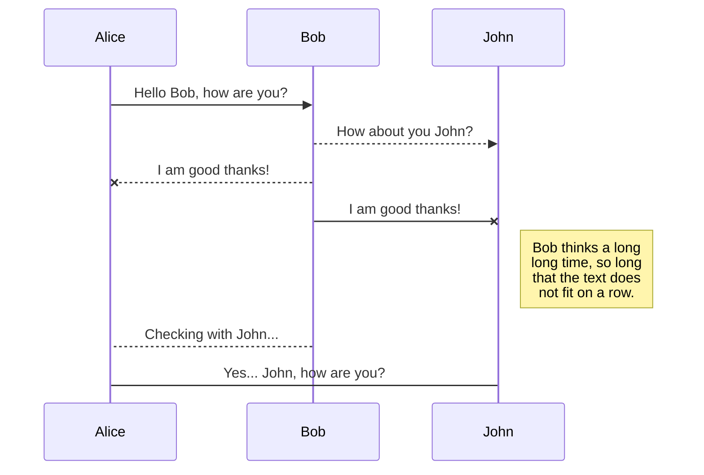
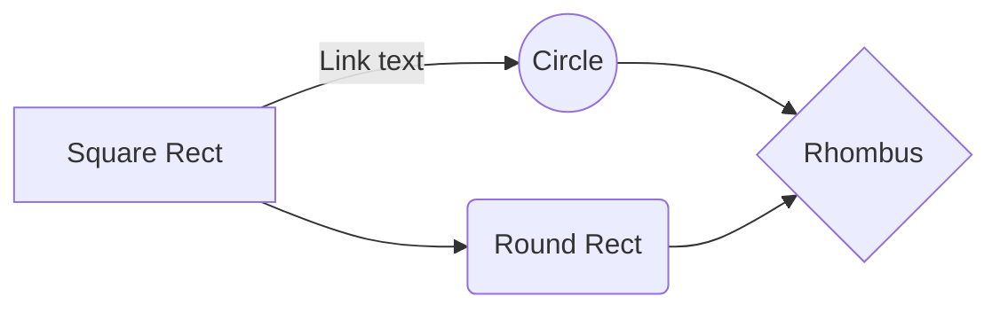

# スケジュール
3/10 ゲーム部分完成
3/17 UIもろもろ完成
3/24 リリース準備完了

# やること

### ゲーム

 1. 餌をたべる
 2. 餌を食べないと時間で死ぬ
 3. 餌を食べると生存時間が増える
 4. 餌を放置すると成長する（小→大→腐→ゾンビ）
 5. ゾンビは自分を追いかけてくる（3種類くらいAI作成）
 6. 

### UI

 1. 胃袋
 2. スコア
 3. タイトル

### その他

 1. ランキング
 2. AdMob

## UML 表示テスト

